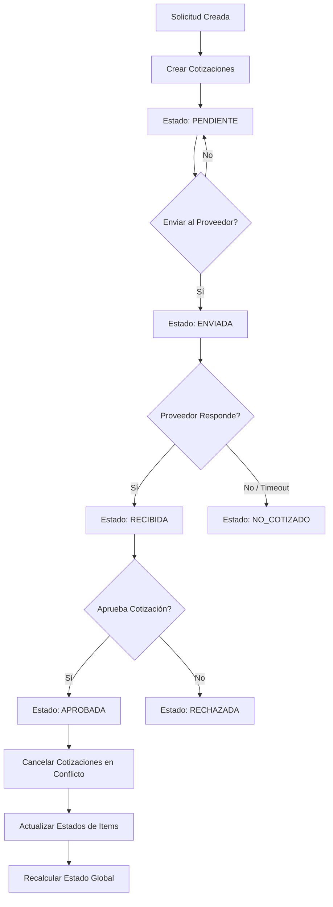
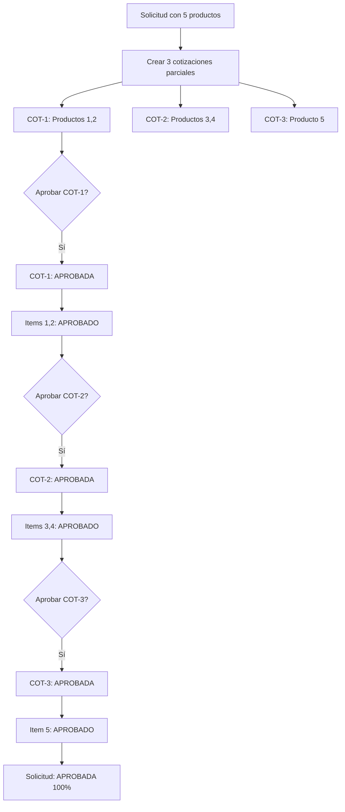
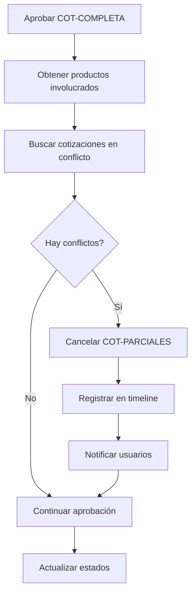

# Plan de Estados y Aprobaciones de Cotizaciones - Módulo Insumos

## Fecha: 26 de febrero de 2026

---

## 📋 Tabla de Contenidos

1. [Contexto General](#contexto-general)
2. [Estados del Sistema](#estados-del-sistema)
3. [Reglas de Negocio Fundamentales](#reglas-de-negocio-fundamentales)
4. [Flujos de Aprobación](#flujos-de-aprobación)
5. [Manejo de Cotizaciones Parciales](#manejo-de-cotizaciones-parciales)
6. [Transiciones de Estado](#transiciones-de-estado)
7. [Casos Edge y Restricciones](#casos-edge-y-restricciones)
8. [Iconografía y UI](#iconografía-y-ui)
9. [Implementación Técnica](#implementación-técnica)

---

## 1. Contexto General

El módulo de Insumos gestiona cotizaciones con **granularidad por ítem**, permitiendo:

- **Múltiples cotizaciones** por solicitud
- **Cotizaciones parciales** (un proveedor cotiza solo algunos productos de la solicitud)
- **Aprobación de cotización completa** (se aprueba la cotización entera con todos sus items, NO se pueden aprobar productos individuales)
- **Múltiples cotizaciones aprobadas** si no comparten productos (combinación estratégica)
- **Trazabilidad total** de cada producto a través de múltiples cotizaciones

### Regla de Oro

**Solo se aprueba LA COTIZACIÓN COMPLETA (con todos los items que ella contenga), NO productos individuales dentro de una cotización.**

**Un producto no puede estar aprobado en dos cotizaciones simultáneamente.**

Cuando se aprueba una cotización, automáticamente se deben **cancelar** todas las demás cotizaciones que contengan AL MENOS UNO de los productos aprobados.

**Cuando el 100% de los productos están aprobados, todas las cotizaciones restantes se rechazan automáticamente.**

---

## 2. Estados del Sistema

### 2.1. Estados de Cotización (SupplyQuotation)

| Estado          | Código         | Descripción                                                      | Color/Badge            |
|-----------------|----------------|------------------------------------------------------------------|------------------------|
| **Borrador**    | `PENDIENTE`    | Cotización creada pero no enviada al proveedor                   | `amber` (Ámbar)        |
| **Enviada**     | `ENVIADA`      | Cotización enviada al proveedor, esperando respuesta             | `sky` (Azul claro)     |
| **Recibida**    | `RECIBIDA`     | Proveedor respondió, datos ingresados manualmente                | `blue` (Azul)          |
| **No Cotizó**   | `NO_COTIZADO`  | Proveedor declinó cotizar (timeout o rechazo explícito)          | `slate` (Gris)         |
| **Aprobada**    | `APROBADA`     | Cotización aprobada, proveedor ganador                           | `emerald` (Verde)      |
| **Rechazada**   | `RECHAZADA`    | Cotización rechazada manualmente o automáticamente               | `red` (Rojo)           |
| **Cancelada**   | `CANCELADA`    | Cotización cancelada por aprobación de otra que incluye sus ítems| `orange` (Naranja)     |

### 2.2. Estados de Item de Solicitud (SupplyRequestItem)

| Estado           | Código          | Descripción                                            | Color/Badge       |
|------------------|-----------------|--------------------------------------------------------|-------------------|
| **Pendiente**    | `PENDIENTE`     | Item creado, sin cotizaciones asociadas                | `amber`           |
| **Cotizado**     | `COTIZADO`      | Al menos una cotización activa incluye este ítem       | `blue`            |
| **Aprobado**     | `APROBADO`      | Ítem con cotización aprobada (proveedor seleccionado)  | `emerald`         |
| **Rechazado**    | `RECHAZADO`     | Todas las cotizaciones del ítem fueron rechazadas      | `red`             |
| **Entregado**    | `ENTREGADO`     | Producto recibido físicamente en bodega                | `green`           |
| **No Disponible**| `NO_DISPONIBLE` | Ningún proveedor puede suministrar el ítem             | `slate`           |

### 2.3. Estados de Solicitud Global (SupplyRequest)

| Estado         | Código        | Descripción                                               | Color/Badge       |
|----------------|---------------|-----------------------------------------------------------|-------------------|
| **Pendiente**  | `PENDIENTE`   | Solicitud creada, sin cotizaciones generadas              | `amber`           |
| **En Proceso** | `EN_PROCESO`  | Al menos una cotización activa (ENVIADA, RECIBIDA)        | `blue`            |
| **Aprobada**   | `APROBADA`    | **Todos** los ítems tienen cotización aprobada            | `emerald`         |
| **Parcial**    | `PARCIAL`     | **Algunos** ítems aprobados, otros en proceso o rechazados| `yellow`          |
| **Rechazada**  | `RECHAZADA`   | Solicitud rechazada manualmente por gerencia              | `red`             |
| **Finalizada** | `FINALIZADA`  | Todos los ítems entregados o cerrados definitivamente     | `slate`           |
| **Anulada**    | `ANULADA`     | Solicitud cancelada antes de procesar cotizaciones        | `orange`          |

---

## 3. Reglas de Negocio Fundamentales

### 3.1. Regla de Exclusividad de Productos

**REGLA 1**: Cuando se aprueba una cotización, se debe ejecutar el siguiente algoritmo:

```typescript
// Pseudocódigo
async function aprobarCotizacion(cotizacionId: string) {
  // 1. Obtener la cotización a aprobar
  const cotizacion = await getCotizacion(cotizacionId);
  const productosInvolucrados = cotizacion.items.map(i => i.requestItemId);

  // 2. Buscar TODAS las cotizaciones que contengan al menos uno de esos productos
  const cotizacionesConflicto = await findCotizacionesConProductos(productosInvolucrados);

  // 3. Cancelar automáticamente todas las cotizaciones en conflicto
  for (const cot of cotizacionesConflicto) {
    if (cot.id !== cotizacionId && cot.statusCode !== 'APROBADA') {
      await updateCotizacionStatus(cot.id, 'CANCELADA', {
        reason: 'EXCLUSION_AUTOMATICA',
        triggeredBy: cotizacionId,
        message: `Cancelada automáticamente por aprobación de cotización ${cotizacion.folio}`
      });
    }
  }

  // 4. Aprobar la cotización seleccionada (completa, con todos sus items)
  await updateCotizacionStatus(cotizacionId, 'APROBADA');

  // 5. Actualizar estados de los ítems a APROBADO
  for (const productoId of productosInvolucrados) {
    await updateRequestItemStatus(productoId, 'APROBADO');
  }

  // 6. Verificar si se completó el 100% de items aprobados
  const solicitud = await getSolicitud(cotizacion.requestId);
  const totalItems = solicitud.items.length;
  const itemsAprobados = solicitud.items.filter(i => i.statusCode === 'APROBADO').length;

  if (itemsAprobados === totalItems) {
    // 100% completo → Rechazar TODAS las cotizaciones restantes
    await rechazarCotizacionesRestantes(cotizacion.requestId, {
      reason: 'SOLICITUD_COMPLETA',
      message: 'Todos los productos ya tienen cotización aprobada'
    });
  }

  // 7. Recalcular estado global de la solicitud
  await recalcularEstadoSolicitud(cotizacion.requestId);
}
```

### 3.2. Regla de Cotizaciones Parciales

**REGLA 2**: Se pueden aprobar múltiples cotizaciones parciales siempre que **NO compartan productos**.

**CASO 1: Todos los proveedores cotizan todos los productos**
```
Solicitud SI-0010: 5 productos cotizados a 5 proveedores

Todos responden los 5 productos:
  - Proveedor 1: Productos 1,2,3,4,5 ($150.000)
  - Proveedor 2: Productos 1,2,3,4,5 ($145.000) ← Mejor precio
  - Proveedor 3: Productos 1,2,3,4,5 ($160.000)
  - Proveedor 4: Productos 1,2,3,4,5 ($148.000)
  - Proveedor 5: Productos 1,2,3,4,5 ($152.000)

✅ Se aprueba la cotización del Proveedor 2 (completa)
❌ Las cotizaciones de Proveedores 1,3,4,5 se CANCELAN automáticamente

📊 Estado de Solicitud: APROBADA (100% de ítems aprobados)
```

**CASO 2: Un proveedor cotiza menos items**
```
Solicitud SI-0020: 5 productos

Proveedor A cotiza solo 4 items (falta Producto 5):
  - Productos 1,2,3,4: $120.000

Proveedor B cotiza todos:
  - Productos 1,2,3,4,5: $155.000

✅ Si se aprueba Proveedor A:
   → Cotización Proveedor B: CANCELADA (productos 1,2,3,4 ya aprobados)
   → Productos 1,2,3,4: APROBADOS
   → Producto 5: PENDIENTE (queda disponible para nueva cotización)

📊 Estado de Solicitud: PARCIAL (80% aprobado, 20% pendiente)
```

**CASO 3: Cotizaciones distribuidas sin overlap**
```
Solicitud SI-0030: 5 productos

Proveedor 1: Productos 1,2
Proveedor 2: Productos 1,2

Proveedor 3: Productos 3,4
Proveedor 4: Productos 3,4

Proveedor 5: Producto 5

✅ Si se aprueba Proveedor 1 (productos 1,2):
   → Proveedor 2: CANCELADA (comparte productos 1,2)
   → Proveedores 3,4,5: ACTIVAS (no comparten productos)

✅ Luego se aprueba Proveedor 3 (productos 3,4):
   → Proveedor 4: CANCELADA (comparte productos 3,4)
   → Proveedor 5: ACTIVA

✅ Luego se aprueba Proveedor 5 (producto 5):
   → 100% de productos aprobados
   → ❌ Todas las cotizaciones restantes: RECHAZADAS automáticamente

📊 Estado de Solicitud: APROBADA (100% de ítems aprobados)
```

### 3.3. Regla de Cotización con Overlap

**REGLA 3**: Si se aprueba una cotización que comparte productos con otras, las demás se cancelan automáticamente.

**CASO 4: Cotizaciones con overlap múltiple**
```
Solicitud SI-0040: 5 productos

Proveedor 1: Productos 1,2
Proveedor 2: Productos 1,2
Proveedor 5: Productos 1,2,3,4 (más productos que Prov 1 y 2)

Proveedor 3: Productos 3,4
Proveedor 4: Productos 3,4
Proveedor 5: También cotizó productos 3,4 (overlap)

Proveedor 6: Producto 5

✅ Si se aprueba Proveedor 5 (productos 1,2,3,4):
   → ❌ Proveedor 1: CANCELADA (comparte 1,2)
   → ❌ Proveedor 2: CANCELADA (comparte 1,2)
   → ❌ Proveedor 3: CANCELADA (comparte 3,4)
   → ❌ Proveedor 4: CANCELADA (comparte 3,4)
   → ✅ Proveedor 6: ACTIVA (Producto 5 aún pendiente)

✅ Luego se aprueba Proveedor 6 (producto 5):
   → 100% productos aprobados
   → ❌ Todas las cotizaciones restantes: RECHAZADAS automáticamente

📊 Estado de Solicitud: APROBADA (100% de ítems aprobados)
```

### 3.4. Regla del 100% de Items Aprobados

**REGLA 4 (CRÍTICA)**: Cuando se alcanza el 100% de items aprobados (todos los productos tienen cotización aprobada), **TODAS** las cotizaciones restantes (PENDIENTES, ENVIADAS, RECIBIDAS) se **RECHAZAN AUTOMÁTICAMENTE**.

Esto evita que queden cotizaciones "huérfanas" activas cuando la solicitud ya está completa.

**Ejemplo**:
```
Solicitud con 5 productos:
  - Productos 1,2: Aprobados en COT-001 (Proveedor A)
  - Productos 3,4: Aprobados en COT-002 (Proveedor B)
  - Producto 5: Se aprueba COT-003 (Proveedor C) ← Completa el 100%

❌ Rechazo automático de:
  - COT-004 (Proveedor D): PENDIENTE → RECHAZADA
  - COT-005 (Proveedor E): ENVIADA → RECHAZADA
  - COT-006 (Proveedor F): RECIBIDA → RECHAZADA

📊 Estado de Solicitud: APROBADA (100% de ítems)
```

### 3.5. Regla de Recálculo de Estado Global

**REGLA 5**: El estado de la solicitud se recalcula automáticamente después de cada cambio de estado de cotización o ítem.

**Algoritmo**:
```typescript
async function recalcularEstadoSolicitud(requestId: string) {
  const solicitud = await getRequestWithItems(requestId);
  const totalItems = solicitud.items.length;
  
  const itemsAprobados = solicitud.items.filter(i => i.statusCode === 'APROBADO').length;
  const itemsRechazados = solicitud.items.filter(i => i.statusCode === 'RECHAZADO').length;
  const itemsEntregados = solicitud.items.filter(i => i.statusCode === 'ENTREGADO').length;
  const itemsNoDisponibles = solicitud.items.filter(i => i.statusCode === 'NO_DISPONIBLE').length;

  let nuevoEstado: string;

  // Todos entregados → FINALIZADA
  if (itemsEntregados === totalItems) {
    nuevoEstado = 'FINALIZADA';
  }
  // Todos aprobados → APROBADA
  else if (itemsAprobados === totalItems) {
    nuevoEstado = 'APROBADA';
  }
  // Algunos aprobados → PARCIAL
  else if (itemsAprobados > 0 && itemsAprobados < totalItems) {
    nuevoEstado = 'PARCIAL';
  }
  // Todos rechazados o no disponibles → RECHAZADA
  else if ((itemsRechazados + itemsNoDisponibles) === totalItems) {
    nuevoEstado = 'RECHAZADA';
  }
  // Tiene cotizaciones activas → EN_PROCESO
  else if (solicitud.quotations.some(q => ['ENVIADA', 'RECIBIDA'].includes(q.statusCode))) {
    nuevoEstado = 'EN_PROCESO';
  }
  // Por defecto → PENDIENTE
  else {
    nuevoEstado = 'PENDIENTE';
  }

  await updateRequestStatus(requestId, nuevoEstado);
}
```

---

## 4. Flujos de Aprobación

### 4.1. Flujo Normal de Aprobación



### 4.2. Flujo de Aprobación Parcial



### 4.3. Flujo de Cancelación Automática



---

## 5. Manejo de Cotizaciones Parciales

### 5.1. Escenario Complejo: Múl ltiples Proveedores

**Contexto**: Solicitud con 5 productos, 4 cotizaciones generadas

#### Setup Inicial

```
SOLICITUD SI-0100 (5 productos)

┌─────────────────────────────────────────────────────────────┐
│ Producto 1: "Filtro de Aceite"                              │
│ Producto 2: "Correa de Distribución"                        │
│ Producto 3: "Bujías (Set 4)"                                │
│ Producto 4: "Aceite Motor 10W-40"                           │
│ Producto 5: "Refrigerante 5L"                               │
└─────────────────────────────────────────────────────────────┘

COTIZACIONES GENERADAS:

COT-0201 (Proveedor 1 - Solo especialista en filtros):
  ├─ Producto 1 ($12.500)
  └─ Estado: RECIBIDA

COT-0202 (Proveedor 2 - Repuestos medianos):
  ├─ Producto 2 ($45.000)
  ├─ Producto 3 ($28.000)
  └─ Estado: RECIBIDA

COT-0203 (Proveedor 3 - Lubricantes):
  ├─ Producto 4 ($18.500)
  ├─ Producto 5 ($15.200)
  └─ Estado: RECIBIDA

COT-0204 (Proveedor 4 - Distribuidor completo):
  ├─ Producto 1 ($14.000) ← Más caro que Prov1
  ├─ Producto 2 ($47.000) ← Más caro que Prov2
  ├─ Producto 3 ($30.000) ← Más caro que Prov2
  ├─ Producto 4 ($17.800) ← Más barato que Prov3 ✓
  ├─ Producto 5 ($14.900) ← Más barato que Prov3 ✓
  └─ Estado: RECIBIDA
```

#### Caso A: Aprobación Óptima Parcial

**Acción**: Usuario aprueba las 3 cotizaciones especializadas (COT-0201, COT-0202, COT-0203)

**Resultado**:
```
✅ COT-0201: APROBADA (Producto 1)
✅ COT-0202: APROBADA (Productos 2, 3)
✅ COT-0203: APROBADA (Productos 4, 5)
❌ COT-0204: CANCELADA (Todos sus productos ya están aprobados)

📊 Solicitud: APROBADA (100% ítems aprobados)

💰 Ahorro vs COT-0204 completa:
   Filtro:        $12.500 vs $14.000 = -$1.500
   Correa:        $45.000 vs $47.000 = -$2.000
   Bujías:        $28.000 vs $30.000 = -$2.000
   Aceite:        $18.500 vs $17.800 = +$700
   Refrigerante:  $15.200 vs $14.900 = +$300
   ────────────────────────────────────────────
   TOTAL:         $119.200 vs $123.700 = -$4.500 ✓
```

#### Caso B: Aprobación Completa Prioritaria

**Acción**: Usuario aprueba primero COT-0204 (distribuidor completo)

**Resultado**:
```
✅ COT-0204: APROBADA (Productos 1, 2, 3, 4, 5)
❌ COT-0201: CANCELADA (Producto 1 ya aprobado en COT-0204)
❌ COT-0202: CANCELADA (Productos 2, 3 ya aprobados en COT-0204)
❌ COT-0203: CANCELADA (Productos 4, 5 ya aprobados en COT-0204)

📊 Solicitud: APROBADA (100% ítems aprobados)

⚠️ Ventaja: Un solo proveedor (logística simplificada)
⚠️ Desventaja: Mayor costo total ($4.500 más)
```

#### Caso C: Aprobación Mixta Estratégica

**Acción**: Usuario aprovecha lo mejor de cada cotización

```
Paso 1: Aprobar COT-0201 (mejor precio en Producto 1)
  → ✅ COT-0201: APROBADA (completa con Producto 1)
  → ✅ Producto 1: APROBADO
  → ❌ COT-0204: CANCELADA (contiene Producto 1 ya aprobado)

Paso 2: Aprobar COT-0202 (mejor precio en Productos 2, 3)
  → ✅ COT-0202: APROBADA (completa con Productos 2, 3)
  → ✅ Productos 2, 3: APROBADOS
  → Estado: 3 de 5 productos aprobados (60%)

Paso 3: Aprobar COT-0203 (productos 4, 5)
  → ✅ COT-0203: APROBADA (completa con Productos 4, 5)
  → ✅ Productos 4, 5: APROBADOS
  → ✅ 100% productos aprobados
  → ❌ Todas las cotizaciones restantes: RECHAZADAS automáticamente

📊 Resultado Final:
   - 3 cotizaciones aprobadas (201, 202, 203)
   - Solicitud: APROBADA
   - Ahorro: $4.500 vs cotización única del Proveedor 4

⚠️ IMPORTANTE: No se puede "aprobar parcialmente" una cotización.
   Si COT-0204 tiene productos 1,2,3,4,5 y se aprueba, se aprueban
   TODOS esos productos, cancelando automáticamente las demás.
```

### 5.2. Matriz de Decisión de Aprobación

| Escenario                                     | Acción Permitida | Resultado Esperado                                  |
|-----------------------------------------------|------------------|-----------------------------------------------------|
| Aprobar cotización sin productos conflicto    | ✅ Permitir      | Aprobación exitosa, cancelar cotizaciones en conflicto |
| Aprobar cotización con productos ya aprobados | ❌ Bloquear      | Mostrar error con lista de conflictos               |
| Aprobar cotización que completa el 100%       | ✅ Permitir      | Rechazar automáticamente todas las cotizaciones restantes |
| Rechazar cotización manualmente               | ✅ Permitir      | Items sin cotizaciones activas pasan a RECHAZADO    |
| Cancelar cotización manualmente               | ✅ Permitir      | Solo si no está APROBADA                            |
| Aprobar producto individual de una cotización | ❌ NO PERMITIDO  | Solo se aprueba la cotización completa              |

---

## 6. Transiciones de Estado

### 6.1. Diagrama de Transiciones de Cotización

```
PENDIENTE ─────→ ENVIADA ─────→ RECIBIDA ─────→ APROBADA
    │                │               │               │
    │                │               │               └──→ [FINAL]
    │                │               │
    │                │               └─────→ RECHAZADA ──→ [FINAL]
    │                │
    │                └─────→ NO_COTIZADO ──→ [FINAL]
    │
    └─────→ CANCELADA ──→ [FINAL]

NOTAS:
- Desde PENDIENTE se puede ir a ENVIADA, CANCELADA o RECHAZADA
- Desde ENVIADA se puede ir a RECIBIDA, NO_COTIZADO, CANCELADA
- Desde RECIBIDA se puede ir a APROBADA, RECHAZADA, CANCELADA
- Los estados finales (APROBADA, RECHAZADA, NO_COTIZADO, CANCELADA) son irreversibles
```

### 6.2. Transiciones de Item

```
PENDIENTE ─────→ COTIZADO ─────→ APROBADO ─────→ ENTREGADO
    │                │               │               │
    │                │               │               └──→ [FINAL]
    │                │               │
    │                └─────→ RECHAZADO ──→ [PUEDE VOLVER A COTIZADO]
    │
    └─────→ NO_DISPONIBLE ──→ [FINAL]

NOTAS:
- Items en RECHAZADO pueden volver a COTIZADO si se crea nueva cotización
- ENTREGADO es el estado final exitoso
- NO_DISPONIBLE se usa cuando ningún proveedor puede suministrar el ítem
```

### 6.3. Transiciones de Solicitud Global

```
PENDIENTE ─────→ EN_PROCESO ─────→ PARCIAL ─────→ APROBADA ─────→ FINALIZADA
    │                │                  │              │               │
    │                │                  │              │               └──→ [COMPLETO]
    │                │                  └──────────────┘
    │                │
    │                └─────→ RECHAZADA ──→ [FINAL NEGATIVO]
    │
    └─────→ ANULADA ──→ [CANCELACIÓN TEMPRANA]

NOTAS:
- EN_PROCESO: Al menos una cotización en estado ENVIADA o RECIBIDA
- PARCIAL: Algunos ítems aprobados, otros aún en proceso
- APROBADA: Todos los ítems con cotización aprobada
- FINALIZADA: Todos los ítems entregados físicamente
```

---

## 7. Casos Edge y Restricciones

### 7.1. ¿Qué pasa si se rechaza una cotización?

**Escenario**: Cotización COT-0150 (Productos 1, 2, 3) es rechazada manualmente.

**Comportamiento**:
1. ✅ Cotización pasa a estado `RECHAZADA`
2. ✅ Los ítems 1, 2, 3 **NO** cambian automáticamente a RECHAZADO
3. ✅ Si existen otras cotizaciones activas para esos productos, siguen disponibles
4. ✅ Solo si **TODAS** las cotizaciones de un ítem son rechazadas, el ítem pasa a `RECHAZADO`

**Ejemplo**:
```
Producto 1 tiene 2 cotizaciones:
  - COT-0150 (Proveedor A): RECHAZADA
  - COT-0151 (Proveedor B): RECIBIDA

Resultado:
  → Producto 1 mantiene estado COTIZADO (aún tiene COT-0151 disponible)

Si ahora rechazo COT-0151:
  → Producto 1 pasa automáticamente a RECHAZADO
```

### 7.2. ¿Qué pasa si hay timeout del proveedor?

**Escenario**: Cotización enviada hace 15 días sin respuesta.

**Opción 1 - Manual**:
- Usuario marca manualmente la cotización como `NO_COTIZADO`
- Sistema pregunta: "¿Marcar como no disponible o crear nueva cotización?"

**Opción 2 - Automática** (recomendada):
- Configuración: `timeout_days: 7` en `supply_module_config`
- Job nocturno ejecuta:
  ```typescript
  async function checkQuotationTimeouts() {
    const fecha = new Date();
    fecha.setDate(fecha.getDate() - 7); // 7 días atrás

    const timeoutQuotations = await prisma.supplyQuotation.findMany({
      where: {
        statusCode: 'ENVIADA',
        sentAt: { lte: fecha }
      }
    });

    for (const quot of timeoutQuotations) {
      await updateQuotationStatus(quot.id, 'NO_COTIZADO', {
        reason: 'TIMEOUT_AUTOMATICO',
        message: 'Proveedor no respondió en 7 días'
      });
    }
  }
  ```

### 7.3. ¿Puedo aprobar productos individuales de una cotización?

**Respuesta**: ❌ **ABSOLUTAMENTE NO**

**Regla Fundamental**:
- Solo se puede aprobar **LA COTIZACIÓN COMPLETA** (con todos los items que ella contenga)
- NO existe funcionalidad para seleccionar productos individuales dentro de una cotización
- SI una cotización tiene 5 productos, al aprobarla se aprueban LOS 5 productos

**Ejemplo de restricción**:
```
Cotización COT-0100 (Proveedor A):
  - Producto 1: $10.000
  - Producto 2: $15.000  ← Precio excelente
  - Producto 3: $50.000  ← Precio muy alto

❌ NO SE PUEDE: Aprobar solo el Producto 2 de esta cotización
✅ SI SE PUEDE: 
   - Aprobar la cotización completa (los 3 productos)
   - O rechazar la cotización completa
   - O solicitar al proveedor que cotice solo el Producto 2 (nueva cotización)
```

**Solución para aprovechar precios selectivos**:
1. Crear cotizaciones parciales desde el inicio (solicitar al proveedor que cotice menos items)
2. Si una cotización tiene precios mixtos, crear nueva cotización solo con los items deseados
3. Combinar múltiples cotizaciones parciales sin overlap de productos

### 7.4. ¿Puedo editar una cotización aprobada?

**Respuesta**: ❌ **NO**

**Restricción de Integridad**:
- Una vez que una cotización está en estado `APROBADA`, **NO** se puede:
  - Cambiar montos
  - Agregar/eliminar ítems
  - Cambiar proveedor
  - Revertir a estado anterior

**Alternativa**:
1. Crear nueva cotización con los cambios
2. Aprobar la nueva cotización (cancelará automáticamente la anterior)
3. Mantener trazabilidad completa en el timeline

### 7.5. ¿Puedo aprobar dos cotizaciones con el mismo producto?

**Respuesta**: ❌ **NO** (validación en frontend y backend)

**Validación en Frontend** (antes de mostrar botón "Aprobar"):
```typescript
async function canApproveCotizacion(cotizacionId: string): boolean {
  const cot = await getCotizacion(cotizacionId);
  const productosInvolucrados = cot.items.map(i => i.requestItemId);

  // Buscar si algún producto ya está aprobado en otra cotización
  const conflictos = await findCotizacionesAprobadas({
    requestId: cot.requestId,
    contieneProductos: productosInvolucrados
  });

  if (conflictos.length > 0) {
    mostrarDialogConflicto(conflictos);
    return false;
  }

  return true;
}
```

**Validación en Backend** (doble check de seguridad):
```typescript
async function aprobarCotizacion(cotizacionId: string) {
  // 1. Verificar conflictos
  const conflictos = await checkProductConflicts(cotizacionId);
  
  if (conflictos.length > 0) {
    throw new BusinessRuleError(
      `No se puede aprobar: los siguientes productos ya están aprobados en otras cotizaciones:\n${
        conflictos.map(c => `- ${c.productName} (aprobado en ${c.quotationFolio})`).join('\n')
      }`
    );
  }

  // 2. Continuar con aprobación...
}
```

### 7.6. ¿Qué pasa si anulo la solicitud completa?

**Escenario**: Solicitud SI-0200 anulada por gerencia.

**Comportamiento en Cascada**:
```typescript
async function anularSolicitud(requestId: string, reason: string) {
  await prisma.$transaction(async (tx) => {
    // 1. Actualizar estado de la solicitud
    await tx.supplyRequest.update({
      where: { id: requestId },
      data: { statusCode: 'ANULADA' }
    });

    // 2. Cancelar TODAS las cotizaciones activas
    await tx.supplyQuotation.updateMany({
      where: {
        requestId,
        statusCode: { notIn: ['APROBADA'] } // No tocar las ya aprobadas
      },
      data: { statusCode: 'CANCELADA' }
    });

    // 3. Registrar en timeline
    await tx.supplyRequestTimeline.create({
      data: {
        requestId,
        action: 'SOLICITUD_ANULADA',
        description: `Solicitud anulada: ${reason}`,
        metadata: { reason }
      }
    });

    // 4. Notificar a proveedores con cotizaciones activas
    await notifySuppliersCancellation(requestId);
  });
}
```

---

## 8. Iconografía y UI

### 8.1. Iconos por Estado de Cotización

| Estado       | Icono Lucide     | Color       | Tooltip                                   |
|--------------|------------------|-------------|-------------------------------------------|
| PENDIENTE    | `Clock`          | Ámbar       | "Pendiente de envío"                      |
| ENVIADA      | `Send`           | Azul claro  | "Enviada al proveedor el DD/MM/YYYY"      |
| RECIBIDA     | `CheckCircle2`   | Azul        | "Respuesta recibida el DD/MM/YYYY"        |
| NO_COTIZADO  | `XCircle`        | Gris        | "Proveedor no cotizó"                     |
| APROBADA     | `CheckCheck`     | Verde       | "Aprobada por [Usuario] el DD/MM/YYYY"    |
| RECHAZADA    | `Ban`            | Rojo        | "Rechazada: [Motivo]"                     |
| CANCELADA    | `AlertCircle`    | Naranja     | "Cancelada por aprobación de [Folio]"     |

### 8.2. Botones de Acción por Estado

#### En Tab "Cotizaciones" de la Solicitud

```typescript
function renderCotizacionActions(quotation) {
  const { statusCode, folio } = quotation;
  const hasPermissionManage = userHasPermission('Gestiona Cotizaciones');
  const hasPermissionApprove = userHasPermission('Aprueba Cotizaciones');

  // Array de acciones disponibles
  const actions = [];

  // ── Acciones según estado ──
  switch (statusCode) {
    case 'PENDIENTE':
      if (hasPermissionManage) {
        actions.push({
          icon: 'Send',
          label: 'Enviar al Proveedor',
          onClick: () => openEmailDialog(quotation.id),
          variant: 'default'
        });
        actions.push({
          icon: 'Pencil',
          label: 'Editar',
          onClick: () => openEditDialog(quotation.id),
          variant: 'ghost'
        });
        actions.push({
          icon: 'Trash2',
          label: 'Eliminar',
          onClick: () => confirmDelete(quotation.id),
          variant: 'ghost',
          destructive: true
        });
      }
      break;

    case 'ENVIADA':
      if (hasPermissionManage) {
        actions.push({
          icon: 'FileInput',
          label: 'Ingresar Respuesta',
          onClick: () => openManualDialog(quotation.id),
          variant: 'default'
        });
        actions.push({
          icon: 'MailX',
          label: 'Marcar como No Cotizado',
          onClick: () => markAsNoCotizado(quotation.id),
          variant: 'outline'
        });
      }
      break;

    case 'RECIBIDA':
      if (hasPermissionApprove) {
        actions.push({
          icon: 'CheckCheck',
          label: 'Aprobar',
          onClick: () => openApproveDialog(quotation.id),
          variant: 'default',
          className: 'bg-emerald-600 hover:bg-emerald-700 text-white'
        });
        actions.push({
          icon: 'Ban',
          label: 'Rechazar',
          onClick: () => openRejectDialog(quotation.id),
          variant: 'outline',
          destructive: true
        });
      }
      if (hasPermissionManage) {
        actions.push({
          icon: 'Pencil',
          label: 'Editar Montos',
          onClick: () => openManualDialog(quotation.id),
          variant: 'ghost'
        });
      }
      break;

    case 'APROBADA':
      if (hasPermissionManage) {
        actions.push({
          icon: 'FileText',
          label: 'Generar PDF',
          onClick: () => generatePDF(quotation.id),
          variant: 'outline'
        });
        actions.push({
          icon: 'Mail',
          label: 'Notificar Proveedor',
          onClick: () => sendApprovalEmail(quotation.id),
          variant: 'default'
        });
        actions.push({
          icon: 'ShoppingCart',
          label: 'Ver Orden de Compra',
          onClick: () => viewPurchaseOrder(quotation.purchaseOrderNumber),
          variant: 'ghost'
        });
      }
      break;

    case 'RECHAZADA':
    case 'NO_COTIZADO':
    case 'CANCELADA':
      // Solo acciones de consulta
      actions.push({
        icon: 'Eye',
        label: 'Ver Detalle',
        onClick: () => openDetailDialog(quotation.id),
        variant: 'ghost'
      });
      actions.push({
        icon: 'FileText',
        label: 'Ver Historial',
        onClick: () => openTimelineDialog(quotation.id),
        variant: 'ghost'
      });
      break;
  }

  // ── Acción siempre disponible ──
  actions.push({
    icon: 'Eye',
    label: 'Ver Detalle',
    onClick: () => openDetailDialog(quotation.id),
    variant: 'ghost'
  });

  return <DropdownMenu actions={actions} />;
}
```

### 8.3. Badges de Estado con Tooltips Informativos

```tsx
<Tooltip>
  <TooltipTrigger>
    <Badge 
      variant="outline" 
      className={getQuotationStatusClass(statusCode)}
    >
      <Icon className="mr-1 h-3 w-3" />
      {statusLabel}
    </Badge>
  </TooltipTrigger>
  <TooltipContent side="top" className="max-w-sm">
    <div className="space-y-1 text-xs">
      <p className="font-semibold">{statusLabel}</p>
      {statusCode === 'APROBADA' && (
        <>
          <p>Aprobada por: {approver.fullName}</p>
          <p>Fecha: {formatDate(approvedAt)}</p>
          <p>OC N°: {purchaseOrderNumber || 'Pendiente'}</p>
        </>
      )}
      {statusCode === 'RECHAZADA' && (
        <>
          <p>Rechazada por: {rejecter.fullName}</p>
          <p>Motivo: {rejectionReason}</p>
        </>
      )}
      {statusCode === 'CANCELADA' && (
        <>
          <p>Cancelada automáticamente</p>
          <p>Razón: Productos aprobados en {triggeredByFolio}</p>
        </>
      )}
    </div>
  </TooltipContent>
</Tooltip>
```

---

## 9. Implementación Técnica

### 9.1. Actualización del Service Layer

**Archivo**: `lib/services/supply/supply-request-service.ts`

```typescript
/**
 * Aprueba una cotización y cancela automáticamente las que tienen conflictos
 */
async approveQuotation(
  quotationId: string,
  userId: string,
  purchaseOrderNumber?: string
): Promise<void> {
  return this.prisma.$transaction(async (tx) => {
    // 1. Verificar que la cotización existe y está en estado válido
    const quotation = await tx.supplyQuotation.findUnique({
      where: { id: quotationId },
      include: {
        items: { select: { requestItemId: true } },
        request: { select: { id: true, folio: true } }
      }
    });

    if (!quotation) {
      throw new SupplyRequestBusinessError('Cotización no encontrada');
    }

    if (quotation.statusCode === 'APROBADA') {
      throw new SupplyRequestBusinessError('La cotización ya está aprobada');
    }

    if (!['RECIBIDA', 'PENDIENTE'].includes(quotation.statusCode)) {
      throw new SupplyRequestBusinessError(
        `No se puede aprobar una cotización en estado ${quotation.statusCode}`
      );
    }

    // 2. Obtener IDs de productos involucrados
    const productIds = quotation.items.map(item => item.requestItemId);

    // 3. Buscar cotizaciones en conflicto (que contengan alguno de esos productos)
    const conflictingQuotations = await tx.supplyQuotation.findMany({
      where: {
        requestId: quotation.requestId,
        id: { not: quotationId },
        statusCode: { notIn: ['APROBADA', 'RECHAZADA', 'CANCELADA', 'NO_COTIZADO'] },
        items: {
          some: {
            requestItemId: { in: productIds }
          }
        }
      },
      select: { id: true, folio: true }
    });

    // 4. Validar que ningún producto ya esté aprobado en otra cotización
    const approvedConflicts = await tx.supplyQuotation.findMany({
      where: {
        requestId: quotation.requestId,
        statusCode: 'APROBADA',
        items: {
          some: {
            requestItemId: { in: productIds }
          }
        }
      },
      include: {
        items: {
          where: { requestItemId: { in: productIds } },
          include: { requestItem: { select: { itemName: true } } }
        }
      }
    });

    if (approvedConflicts.length > 0) {
      const conflictDetails = approvedConflicts.flatMap(cot =>
        cot.items.map(item => ({
          product: item.requestItem.itemName,
          quotation: cot.folio
        }))
      );

      throw new SupplyRequestBusinessError(
        `No se puede aprobar: los siguientes productos ya están aprobados:\n${
          conflictDetails.map(c => `- ${c.product} (en ${c.quotation})`).join('\n')
        }`
      );
    }

    // 5. Cancelar cotizaciones en conflicto
    for (const conflict of conflictingQuotations) {
      await tx.supplyQuotation.update({
        where: { id: conflict.id },
        data: {
          statusCode: 'CANCELADA',
          updatedAt: new Date()
        }
      });

      // Registrar timeline de cancelación
      await tx.supplyRequestTimeline.create({
        data: {
          requestId: quotation.requestId,
          action: 'COTIZACION_CANCELADA_AUTO',
          description: `Cotización ${conflict.folio} cancelada automáticamente por aprobación de ${quotation.folio}`,
          metadata: {
            cancelledQuotationId: conflict.id,
            approvedQuotationId: quotationId,
            reason: 'EXCLUSION_PRODUCTOS'
          },
          createdBy: userId
        }
      });
    }

    // 6. Aprobar la cotización
    await tx.supplyQuotation.update({
      where: { id: quotationId },
      data: {
        statusCode: 'APROBADA',
        approvedAt: new Date(),
        approvedBy: userId,
        purchaseOrderNumber: purchaseOrderNumber || null,
        updatedAt: new Date()
      }
    });

    // 7. Actualizar estados de los ítems a APROBADO
    await tx.supplyRequestItem.updateMany({
      where: {
        id: { in: productIds }
      },
      data: {
        statusCode: 'APROBADO',
        updatedAt: new Date()
      }
    });

    // 8. Registrar timeline de aprobación
    await tx.supplyRequestTimeline.create({
      data: {
        requestId: quotation.requestId,
        action: 'COTIZACION_APROBADA',
        description: `Cotización ${quotation.folio} aprobada${
          purchaseOrderNumber ? ` (OC: ${purchaseOrderNumber})` : ''
        }`,
        metadata: {
          quotationId,
          approvedItemIds: productIds,
          cancelledQuotations: conflictingQuotations.map(c => c.folio)
        },
        createdBy: userId
      }
    });

    // 9. Verificar si se completó el 100% de items
    const requestWithItems = await tx.supplyRequest.findUnique({
      where: { id: quotation.requestId },
      include: {
        items: { select: { id: true, statusCode: true } }
      }
    });

    if (requestWithItems) {
      const totalItems = requestWithItems.items.length;
      const itemsAprobados = requestWithItems.items.filter(i => i.statusCode === 'APROBADO').length;

      // Si 100% aprobado, rechazar TODAS las cotizaciones restantes
      if (itemsAprobados === totalItems) {
        const remainingQuotations = await tx.supplyQuotation.findMany({
          where: {
            requestId: quotation.requestId,
            statusCode: { in: ['PENDIENTE', 'ENVIADA', 'RECIBIDA'] }
          },
          select: { id: true, folio: true }
        });

        for (const remaining of remainingQuotations) {
          await tx.supplyQuotation.update({
            where: { id: remaining.id },
            data: {
              statusCode: 'RECHAZADA',
              rejectionReason: 'Todos los productos ya tienen cotización aprobada',
              rejectedAt: new Date(),
              updatedAt: new Date()
            }
          });

          await tx.supplyRequestTimeline.create({
            data: {
              requestId: quotation.requestId,
              action: 'COTIZACION_RECHAZADA_AUTO',
              description: `Cotización ${remaining.folio} rechazada automáticamente por completar 100% de productos aprobados`,
              metadata: {
                quotationId: remaining.id,
                reason: 'SOLICITUD_COMPLETA_100'
              },
              createdBy: userId
            }
          });
        }
      }
    }

    // 10. Recalcular estado global de la solicitud
    await this.recalculateRequestStatus(tx, quotation.requestId);

    // 11. Notificar proveedores afectados (async, no bloquea)
    setImmediate(() => {
      this.notifyQuotationApproval(quotationId).catch(console.error);
      conflictingQuotations.forEach(cot => {
        this.notifyQuotationCancellation(cot.id).catch(console.error);
      });
    });
  });
}

/**
 * Recalcula el estado global de la solicitud basado en estados de ítems
 */
private async recalculateRequestStatus(
  tx: Prisma.TransactionClient,
  requestId: string
): Promise<void> {
  const request = await tx.supplyRequest.findUnique({
    where: { id: requestId },
    include: {
      items: { select: { statusCode: true } },
      quotations: { select: { statusCode: true } }
    }
  });

  if (!request) return;

  const totalItems = request.items.length;
  const itemsAprobados = request.items.filter(i => i.statusCode === 'APROBADO').length;
  const itemsEntregados = request.items.filter(i => i.statusCode === 'ENTREGADO').length;
  const itemsRechazados = request.items.filter(i => i.statusCode === 'RECHAZADO').length;
  const itemsNoDisponibles = request.items.filter(i => i.statusCode === 'NO_DISPONIBLE').length;

  const hasActiveQuotations = request.quotations.some(q =>
    ['ENVIADA', 'RECIBIDA'].includes(q.statusCode)
  );

  let newStatus: string;

  if (itemsEntregados === totalItems) {
    newStatus = 'FINALIZADA';
  } else if (itemsAprobados === totalItems) {
    newStatus = 'APROBADA';
  } else if (itemsAprobados > 0 && itemsAprobados < totalItems) {
    newStatus = 'PARCIAL';
  } else if ((itemsRechazados + itemsNoDisponibles) === totalItems) {
    newStatus = 'RECHAZADA';
  } else if (hasActiveQuotations) {
    newStatus = 'EN_PROCESO';
  } else {
    newStatus = 'PENDIENTE';
  }

  if (request.statusCode !== newStatus) {
    await tx.supplyRequest.update({
      where: { id: requestId },
      data: { statusCode: newStatus, updatedAt: new Date() }
    });

    await tx.supplyRequestTimeline.create({
      data: {
        requestId,
        action: 'ESTADO_CAMBIADO',
        description: `Estado de solicitud cambió de ${request.statusCode} a ${newStatus}`,
        metadata: {
          previousStatus: request.statusCode,
          newStatus,
          itemStats: { totalItems, itemsAprobados, itemsEntregados, itemsRechazados }
        }
      }
    });
  }
}

/**
 * Rechaza una cotización
 */
async rejectQuotation(
  quotationId: string,
  userId: string,
  reason: string
): Promise<void> {
  return this.prisma.$transaction(async (tx) => {
    const quotation = await tx.supplyQuotation.findUnique({
      where: { id: quotationId },
      include: {
        items: { select: { requestItemId: true } },
        request: { select: { id: true, folio: true } }
      }
    });

    if (!quotation) {
      throw new SupplyRequestBusinessError('Cotización no encontrada');
    }

    if (quotation.statusCode === 'APROBADA') {
      throw new SupplyRequestBusinessError('No se puede rechazar una cotización aprobada');
    }

    // 1. Actualizar cotización
    await tx.supplyQuotation.update({
      where: { id: quotationId },
      data: {
        statusCode: 'RECHAZADA',
        rejectedAt: new Date(),
        rejectedBy: userId,
        rejectionReason: reason,
        updatedAt: new Date()
      }
    });

    // 2. Verificar si algún ítem debe cambiar a RECHAZADO
    const productIds = quotation.items.map(i => i.requestItemId);

    for (const productId of productIds) {
      // Contar cotizaciones activas para este producto
      const activeQuotations = await tx.supplyQuotation.count({
        where: {
          requestId: quotation.requestId,
          statusCode: { in: ['PENDIENTE', 'ENVIADA', 'RECIBIDA'] },
          items: {
            some: { requestItemId: productId }
          }
        }
      });

      // Si no hay más cotizaciones activas, marcar ítem como RECHAZADO
      if (activeQuotations === 0) {
        await tx.supplyRequestItem.update({
          where: { id: productId },
          data: { statusCode: 'RECHAZADO', updatedAt: new Date() }
        });
      }
    }

    // 3. Registrar en timeline
    await tx.supplyRequestTimeline.create({
      data: {
        requestId: quotation.requestId,
        action: 'COTIZACION_RECHAZADA',
        description: `Cotización ${quotation.folio} rechazada: ${reason}`,
        metadata: {
          quotationId,
          reason,
          affectedItemIds: productIds
        },
        createdBy: userId
      }
    });

    // 4. Recalcular estado global
    await this.recalculateRequestStatus(tx, quotation.requestId);
  });
}

/**
 * Marca una cotización como NO_COTIZADO (proveedor no respondió)
 */
async markAsNoCotizado(
  quotationId: string,
  userId: string,
  reason: string
): Promise<void> {
  return this.prisma.$transaction(async (tx) => {
    const quotation = await tx.supplyQuotation.findUnique({
      where: { id: quotationId },
      include: {
        items: { select: { requestItemId: true } },
        request: { select: { id: true, folio: true } }
      }
    });

    if (!quotation) {
      throw new SupplyRequestBusinessError('Cotización no encontrada');
    }

    await tx.supplyQuotation.update({
      where: { id: quotationId },
      data: {
        statusCode: 'NO_COTIZADO',
        rejectionReason: reason,
        updatedAt: new Date()
      }
    });

    await tx.supplyRequestTimeline.create({
      data: {
        requestId: quotation.requestId,
        action: 'COTIZACION_NO_COTIZADO',
        description: `Cotización ${quotation.folio} marcada como No Cotizado: ${reason}`,
        metadata: {
          quotationId,
          reason
        },
        createdBy: userId
      }
    });

    await this.recalculateRequestStatus(tx, quotation.requestId);
  });
}

/**
 * Notificaciones asíncronas
 */
private async notifyQuotationApproval(quotationId: string): Promise<void> {
  // Implementar envío de correo al proveedor ganador
  // Incluir PDF de orden de compra
}

private async notifyQuotationCancellation(quotationId: string): Promise<void> {
  // Implementar envío de correo a proveedores informando cancelación
}
```

### 9.2. Nuevas Server Actions

**Archivo**: `app/insumos/[id]/actions.ts`

```typescript
/**
 * Aprueba una cotización con validación de conflictos
 */
export async function aprobarCotizacion(
  quotationId: string,
  requestId: string,
  purchaseOrderNumber?: string
): Promise<ActionResult> {
  const session = await verifySession();
  if (!session) return { success: false, error: 'No autorizado' };

  try {
    await supplyRequestService.approveQuotation(
      quotationId,
      session.user.id,
      purchaseOrderNumber
    );

    revalidatePath(`/insumos/${requestId}`);
    revalidatePath('/insumos/listado');

    return { success: true };
  } catch (error) {
    if (error instanceof SupplyRequestBusinessError) {
      return { success: false, error: error.message };
    }
    console.error('Error aprobando cotización:', error);
    return { success: false, error: 'Error al aprobar la cotización.' };
  }
}

/**
 * Rechaza una cotización con motivo obligatorio
 */
export async function rechazarCotizacion(
  quotationId: string,
  requestId: string,
  reason: string
): Promise<ActionResult> {
  const session = await verifySession();
  if (!session) return { success: false, error: 'No autorizado' };

  if (!reason || reason.trim().length < 10) {
    return { success: false, error: 'Debe ingresar un motivo (mínimo 10 caracteres)' };
  }

  try {
    await supplyRequestService.rejectQuotation(quotationId, session.user.id, reason);

    revalidatePath(`/insumos/${requestId}`);
    revalidatePath('/insumos/listado');

    return { success: true };
  } catch (error) {
    if (error instanceof SupplyRequestBusinessError) {
      return { success: false, error: error.message };
    }
    console.error('Error rechazando cotización:', error);
    return { success: false, error: 'Error al rechazar la cotización.' };
  }
}

/**
 * Marca cotización como No Cotizado
 */
export async function marcarNoCotizado(
  quotationId: string,
  requestId: string,
  reason: string
): Promise<ActionResult> {
  const session = await verifySession();
  if (!session) return { success: false, error: 'No autorizado' };

  try {
    await supplyRequestService.markAsNoCotizado(quotationId, session.user.id, reason);

    revalidatePath(`/insumos/${requestId}`);

    return { success: true };
  } catch (error) {
    if (error instanceof SupplyRequestBusinessError) {
      return { success: false, error: error.message };
    }
    console.error('Error marcando como no cotizado:', error);
    return { success: false, error: 'Error al actualizar la cotización.' };
  }
}
```

### 9.3. Migración de Base de Datos

**Agregar nuevo estado `CANCELADA` y campo nuevo estado `PARCIAL` para solicitudes**:

```sql
-- Migración: agregar-estados-cancelada-parcial
-- Fecha: 2026-02-26

-- 1. Agregar estado CANCELADA a QuotationStatusMaster
INSERT INTO quotation_status_master (id, code, name, description, color, icon, display_order, is_active)
VALUES (
  gen_random_uuid(),
  'CANCELADA',
  'Cancelada',
  'Cancelada por aprobación de otra cotización que incluye sus productos',
  'orange',
  'AlertCircle',
  70,
  true
)
ON CONFLICT (code) DO NOTHING;

-- 2. Agregar estado PARCIAL a SupplyRequestStatusMaster
INSERT INTO supply_request_status_master (id, code, name, description, color, icon, display_order, is_active)
VALUES (
  gen_random_uuid(),
  'PARCIAL',
  'Parcialmente Aprobada',
  'Algunos ítems aprobados, otros en proceso o rechazados',
  'yellow',
  'Loader',
  35,
  true
)
ON CONFLICT (code) DO NOTHING;
```

---

## 10. Checklist de Implementación

### Fase 1: Backend (Service Layer)

- [ ] Actualizar `supply-request-service.ts` con métodos:
  - [ ] `approveQuotation()`
  - [ ] `rejectQuotation()`
  - [ ] `markAsNoCotizado()`
  - [ ] `recalculateRequestStatus()`
  - [ ] `checkProductConflicts()`
- [ ] Crear errores personalizados en service
- [ ] Agregar logging con AuditLogger
- [ ] Implementar notificaciones asíncronas

### Fase 2: Server Actions

- [ ] Crear `aprobarCotizacion()`
- [ ] Crear `rechazarCotizacion()`
- [ ] Crear `marcarNoCotizado()`
- [ ] Validaciones de permisos
- [ ] Validaciones de negocio (motivo obligatorio, etc.)

### Fase 3: Frontend - Diálogos

- [ ] `ApprovalConfirmDialog`: Confirmación de aprobación con lista de productos
- [ ] `RejectionReasonDialog`: Motivo obligatorio (textarea)
- [ ] `ConflictWarningDialog`: Alerta de productos en conflicto
- [ ] `CancellationInfoDialog`: Información de cancelación automática

### Fase 4: Frontend - Tabla de Cotizaciones

- [ ] Actualizar `SupplyRequestDetail.tsx`:
  - [ ] Agregar estado `CANCELADA` a configuración
  - [ ] Agregar estado `PARCIAL` a configuración de solicitud
  - [ ] Implementar lógica de botones según estado
  - [ ] Agregar tooltips informativos en badges
- [ ] Actualizar `columns.tsx` de listado:
  - [ ] Agregar badge `PARCIAL` con color amarillo
  - [ ] Mostrar contadores de ítems aprobados vs totales

### Fase 5: Migración y Seed

- [ ] Ejecutar migración SQL para estados nuevos
- [ ] Actualizar seed con nuevos estados
- [ ] Migrar datos existentes si aplica

### Fase 6: Testing

- [ ] Test unitario: `approveQuotation()` con conflictos
- [ ] Test unitario: `recalculateRequestStatus()` todos los casos
- [ ] Test E2E: Aprobar cotización completa
- [ ] Test E2E: Aprobar cotizaciones parciales sin conflicto
- [ ] Test E2E: Intentar aprobar con conflicto (debe fallar)
- [ ] Test E2E: Rechazar cotización
- [ ] Test E2E: Timeout automático (job nocturno)

### Fase 7: Documentación

- [ ] Actualizar `docs/solicitud-insumos.md` con nuevos flujos
- [ ] Crear documentación de usuario con screenshots
- [ ] Actualizar diagramas de flujo en Mermaid

---

## 11. Consideraciones de Rendimiento

### 11.1. Índices Recomendados

```sql
-- Índice para buscar cotizaciones con productos específicos (query frecuente)
CREATE INDEX IF NOT EXISTS idx_supply_quotation_items_request_item 
ON supply_quotation_items (request_item_id, quotation_id);

-- Índice compuesto para filtrar cotizaciones activas por solicitud
CREATE INDEX IF NOT EXISTS idx_supply_quotations_request_status 
ON supply_quotations (request_id, status_code) 
WHERE status_code IN ('PENDIENTE', 'ENVIADA', 'RECIBIDA');

-- Índice para timeline ordenado por fecha (consulta frecuente)
CREATE INDEX IF NOT EXISTS idx_supply_request_timeline_request_created 
ON supply_request_timeline (request_id, created_at DESC);
```

### 11.2. Optimización de Queries

```typescript
// ✅ BUENO: Query optimizado con includes específicos
const quotation = await prisma.supplyQuotation.findUnique({
  where: { id: quotationId },
  select: {
    id: true,
    folio: true,
    requestId: true,
    statusCode: true,
    items: {
      select: {
        requestItemId: true
      }
    }
  }
});

// ❌ MALO: Traer todo el objeto (incluye relaciones innecesarias)
const quotation = await prisma.supplyQuotation.findUnique({
  where: { id: quotationId },
  include: {
    items: true,
    supplier: true,
    request: true,
    attachments: true
  }
});
```

---

## 12. Notas Finales

### Puntos Críticos a Vigilar

1. **Deadlocks en Transacciones**: Al aprobar múltiples cotizaciones simultáneamente, usar bloqueos pesimistas
2. **Race Conditions**: Validar conflictos dentro de la transación, no antes
3. **Notificaciones Asíncronas**: No bloquear la transacción principal, usar `setImmediate()` o job queue
4. **Auditoría Completa**: Registrar TODAS las acciones en timeline (aprobación, rechazo, cancelación automática)
5. **Revalidación de Caché**: Siempre `revalidatePath()` después de mutaciones

### Preguntas Frecuentes

**P: ¿Puedo "deshacer" una aprobación?**  
R: No. Para revertir, crear nueva cotización y aprobarla (cancelará la anterior).

**P: ¿Qué pasa si apruebo y luego el proveedor no puede entregar?**  
R: Rechazar la cotización aprobada manualmente, volver a cotizar con otros proveedores.

**P: ¿Cómo sé qué cotizaciones fueron canceladas automáticamente?**  
R: El timeline registra cada cancelación automática con el folio de la cotización que la trigger.

**P: ¿Puedo dividir una cotización aprobada en dos órdenes de compra?**  
R: No. Una cotización aprobada = Una OC. Para dividir, crear 2 cotizaciones separadas desde el inicio.

---

**Documento generado**: 26 de febrero de 2026  
**Versión**: 1.0  
**Responsable**: Equipo de Desarrollo GeoPark  
**Estado**: Propuesta para Revisión
